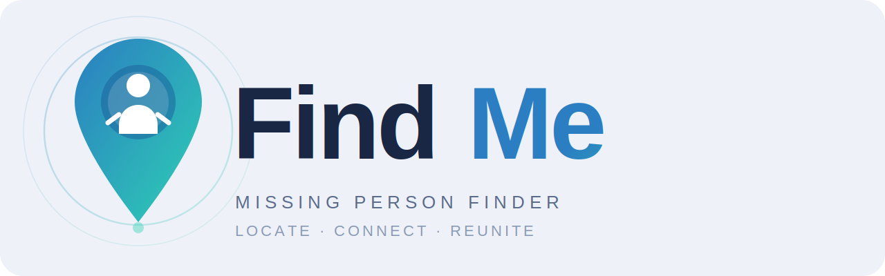

  

<h1 align="center">FindMe</h1>

  A Google Solution Challenge project by RogueDevs for faster missing person reporting, safer disaster response, and coordinated rescue operations.

  
  
  
  
  

## The Problem

During floods, landslides, crowd incidents, and other emergencies, missing person information often gets scattered across phone calls, social media posts, police desks, volunteer groups, relief camps, and handwritten lists. Families need a way to report quickly. Citizens need a trusted place to share sightings. Rescue teams need live information they can act on.

FindMe brings those pieces into one working disaster response platform. It turns a missing person report into a trackable case, checks it against found person records using a dedicated ML engine, gives families a reference number, and gives rescuers a live command workspace for decisions in the field.

## Google Solution Challenge Focus

FindMe is built around the spirit of the Google Solution Challenge: using technology to solve a real community problem with measurable social impact.

It supports these United Nations Sustainable Development Goals:

* SDG 3: Good Health and Well Being, by reducing the time between reporting, verification, medical attention, and reunification.
* SDG 11: Sustainable Cities and Communities, by helping communities respond during disasters and displacement.
* SDG 16: Peace, Justice and Strong Institutions, by giving families and responders a transparent case flow instead of fragmented updates.
* SDG 17: Partnerships for the Goals, by connecting citizens, NGOs, police, field teams, and technical systems in one shared loop.

## What FindMe Does

FindMe is not only a report form. It is a complete response pipeline:

1. A family member or citizen submits a missing person report.
2. The platform stores the report with a human readable reference ID like `FM-A3B9C1`.
3. The ML engine compares missing and found records by name, age, location, physical details, and face images.
4. The public can search active missing reports and subscribe for alerts.
5. A person who is safe can send an "I am safe" check-in.
6. Rescue operators can review live cases, safe reports, shared field updates, map activity, and AI match results.
7. When a person is verified as found, the case is resolved and the public tracking page updates in real time.

## Working Features

### Public Missing Person Reporting

* Four step reporting flow for personal details, last seen information, photo and physical description, and reporter contact.
* Name based duplicate warning before submission, helping avoid repeated reports for the same person.
* Interactive map powered location picker for last seen location.
* India state and district selection with support for custom districts.
* Date and time fields for the last known sighting.
* Photo upload to Firebase Storage.
* Reporter phone and alternate phone capture.
* Consent checkbox before submission.
* Human readable case reference generation.
* Confirmation screen with direct tracking link.
* Client side submission rate limit to reduce spam.
* Anonymous Firebase Auth support so civilians can report without creating an account.

### Found Person Reporting

* Public found person submission flow.
* Optional name, age, gender, physical tags, location description, and photo.
* Photo upload for found person records.
* Location geocoding through OpenStreetMap Nominatim.
* Found person records stored separately for ML comparison against missing reports.
* Submit another flow after a successful report.

### Safe Check-In

* "I am safe" form for people who are safe or need help.
* Status options for safe, safe but needs help, at relief camp, and medical help.
* Phone number capture for verification.
* Relative contact phone and message fields.
* Optional missing report reference linking.
* Location text input plus browser GPS attachment.
* Rescue message field for urgent context.
* Safe reference generation using `SAFE` IDs.
* Automatic task creation for rescuers when a safe check-in needs verification.

### Public Search

* Search active missing person reports.
* Filter by district and gender.
* Expandable missing person result cards.
* Photo, name, age, gender, district, last known location, description, and reference display.
* Match confidence styling for high, possible, and low signal records.
* "Notify me" subscription using phone number storage in Firestore.
* Location reveal panel for report context.
* Contact or tracking action states depending on confidence level.

### Live Case Tracking

* Track a report by reference number.
* Direct URL support through `/track/:refId`.
* Reference normalization, so users can enter codes with or without the `FM` prefix.
* Real time Firestore subscription to case updates.
* Case status display for active, found, and closed states.
* Case timeline showing report received, AI review, rescue response, and resolution.
* Last checked time indicator.
* Reported date, updated date, last seen date, district, and location details.
* Found banner with verifier information when a case is resolved.
* Privacy note for families viewing case progress.

### AI Match Analysis

* Dedicated ML match results screen.
* ML health indicator that checks the matching service.
* Refreshable AI analysis.
* Composite score display for potential matches.
* Score breakdown for name, age, location, and physical tags.
* Estimated distance support when returned by the ML service.
* Side by side comparison modal for found and missing person records.
* Face verification through the ML face matching endpoint.
* Match confirmation flow that writes the chosen found person ID and score back to Firestore.
* Confirmed matches move into rescue review instead of staying as loose suggestions.

### Rescue Operator Access

* Rescue dashboard protected by authentication.
* Rescuer registration form for NGO, Police, NDRF, and SDRF personnel.
* Official email and phone capture.
* Optional ID proof upload.
* Google Sign-In for approved rescuers.
* Email and password account creation and sign-in.
* Registered email verification before dashboard access.
* Operator identity bar with sign out.

### Live Rescue Dashboard

* Split screen command view with operations panel and live map.
* Mobile mode switch between search board and command map.
* Search Board tab for active missing cases.
* Safe tab for safe check-ins.
* Exchange tab for rescuer to rescuer field updates.
* Comms tab for live operational messages.
* AI tab for match analysis inside the rescue workspace.

### Emergency Search Board

* Live Firestore subscription to active missing cases.
* Two operational columns: Missing and Confirmed Match.
* Cases with strong ML signals move into the confirmed match column.
* Task cards synthesized from missing person reports.
* Critical priority styling for matched cases.
* Resolve as found modal.
* Resolution captures found location, district, verifier, contact phone, notes, and resolver identity.
* Case resolution writes to missing person and found person collections.

### Safe Reports Review

* Live list of safe reports.
* Dashboard counters for total, new, linked, and medical reports.
* Search by name, phone, reference, district, or location.
* Status chips for safe, needs help, relief camp, and medical help.
* Display of relative contact and relative message.
* GPS coordinate display when attached.
* Find matches action that checks safe reports against active missing cases.
* Mark reviewed action.
* Confirm safe action that links a safe report to a missing person.
* Linked safe reports create found person records and mark missing cases as found.

### Shared Field Exchange

* Rescuers can share field updates with other teams.
* Updates can be linked to an existing missing person case or created manually.
* Status types include needs help, sighting, verified, rescued, and unresolved.
* Priority levels include critical, high, medium, and low.
* Source types include field, web, IVR, and NGO.
* District, displacement zone, exact location, team name, reference ID, and notes are captured.
* Search and filter by text, status, and priority.
* Stats for updates, critical items, rescued items, and active teams.
* Other operators can add shared requests to the search board as searchable missing person cases.

### Field Information Exchange

* Live rescue communication room.
* Message categories for roadblock, danger, medical, shelter, supply, rescue needed, and general updates.
* Priority tagging for operational urgency.
* District, zone, and landmark fields.
* Search by message, road, camp, district, zone, or location.
* Filter by category, priority, and status.
* Acknowledge button for operators who have seen an update.
* Resolve button for completed field updates.
* Separate styling for the current operator's messages and critical incoming messages.
* Mobile friendly composer and filters.

### Command Map

* Leaflet powered live map.
* Missing person markers and found person markers.
* Firestore subscriptions for live map updates.
* State and district filtering.
* India wide default map view with state zoom behavior.
* Marker popups showing name, age, location, and district.
* Live legend with visible missing and found counts.

### Home And Public Awareness

* Public hero page with direct actions for Search, Report Missing, Report Found, and Rescue Teams.
* Live alert ticker in the navbar with urgent missing reports and platform counters.
* Quick statistics for missing persons, found persons, active camps, and active teams.
* Emergency alert bar with disaster event notice.
* Nearest relief camp finder using browser location.
* Relief camp lookup first checks Firestore verified camps, then falls back to OpenStreetMap Overpass data.
* Google Maps and OpenStreetMap links for discovered relief camps.
* Public bulletin board showing recent missing notices.
* Bulletin filters for all, children, and adults.
* Report found action from bulletin cards.

### Localization

* i18next based translation system.
* English, Hindi, and Telugu translation files.
* Browser language detection support.
* Language selector in the navbar.
* Localized public pages, rescue labels, alerts, and form text.

### Security And Data Handling

* Firebase Authentication for anonymous civilian submissions and authenticated rescue access.
* Firestore rules included for public reads, report creation, role aware rescue operations, and protected updates.
* Firebase Storage rules included for uploaded images and rescuer documents.
* Case references avoid exposing Firestore document IDs as the primary user facing handle.
* Public tracking uses reference based lookup.
* Sensitive rescue actions require signed in operators.

## ML Model Repository

FindMe uses a dedicated ML backend that lives in a separate repository:

[DarkSire7/find-me](https://github.com/DarkSire7/find-me)

That service powers the matching intelligence used by this frontend. The frontend calls it through `VITE_ML_API_URL`, then writes useful match results back into Firebase so rescue operators see them inside the dashboard.

The ML service supports:

* String and profile matching through `/match/strings`.
* Face comparison through `/match/faces`.
* Health checks through `/health`.
* Composite scoring across identity and context signals.
* Per signal breakdown for name, age, location, and physical tags.

## System Architecture

FindMe is organized as four connected layers:

### Citizen Layer

Families, citizens, and found persons use the public app to report missing people, report found people, search active cases, subscribe for alerts, and submit safe check-ins.

### Intelligence Layer

The ML service ranks possible matches between missing and found records. It can compare structured profile information and face images, then returns confidence scores that the frontend turns into actionable rescue states.

### Operations Layer

Rescue teams use the authenticated dashboard to review live cases, verify safe check-ins, share sightings, coordinate field messages, confirm matches, and resolve cases.

### Data Layer

Firebase powers realtime data, authentication, media uploads, hosting, rules, indexes, and operational collections for missing persons, found persons, safe reports, rescue activity, communications, tasks, subscriptions, camps, teams, and stats.

## Tech Stack

### Frontend

  
  
  
  
  
  
  
  
  
  

FindMe's interface is built with React, Vite, route based screens, Tailwind utility styling, Framer Motion transitions, Lucide icons, and i18next localization for English, Hindi, and Telugu.

### Maps And Location

  
  
  
  
  
  
  

Location features use Leaflet and React Leaflet for the command map, OpenStreetMap data for geocoding and relief camp discovery, browser GPS for safe check-ins and nearby camp lookup, and Google Maps deep links for navigation.

### Google Cloud And Firebase

  
  
  
  
  
  
  
  
  
  
  
  

Firebase is the live backbone of the project: Firestore stores cases and rescue activity, Auth separates anonymous public submissions from signed in rescue operators, Storage handles report photos and ID proof uploads, Hosting serves the app, Analytics is initialized for product visibility, and rules plus indexes keep the data model usable and protected.

### Machine Learning

  
  
  
  
  
  

The matching engine lives in [DarkSire7/find-me](https://github.com/DarkSire7/find-me). This app connects to it through `VITE_ML_API_URL` for profile matching, face verification, match health checks, and composite confidence scores that rescue teams can act on.

### Quality

  
  
  
  
  

The codebase is organized around pages, shared components, Firebase service modules, ML service adapters, realtime listener cleanup, and focused security rules for public and rescue workflows.

## Main Routes

`/`  
Public landing, live stats, alerts, bulletin board, relief camp lookup, and action entry points.

`/report`  
Missing person report flow.

`/report-found`  
Found person report flow.

`/safe`  
Safe check-in flow.

`/search`  
Public searchable missing person database.

`/track`  
Reference based case tracking.

`/track/:refId`  
Direct link to a specific case status page.

`/results/:reportId`  
ML match analysis page.

`/rescue`  
Authenticated rescue command dashboard.

## Data Collections

FindMe uses these Firebase collections across the working app:

* `missing_persons` for missing reports and case status.
* `found_persons` for found reports and verified resolutions.
* `safe_reports` for safe check-ins.
* `tasks` for rescue tasks created from missing reports and safe reports.
* `rescue_exchange` for shared inter-team field updates.
* `rescue_comms` for live field communications.
* `rescue_activity` for resolution and linking events.
* `rescuer_requests` for rescue operator registration.
* `notification_subscriptions` for alert subscriptions.
* `stats` for global counters.
* `camps` for verified relief camp records.
* `teams` for active team counts and assignment support.

## Why It Matters

In an emergency, every repeated question costs time. FindMe reduces that delay by giving every report a clear reference, every safe check-in a place to land, every potential match a confidence trail, and every rescue operator a shared view of what is happening.

The goal is simple: make the path from "someone is missing" to "someone is found" shorter, clearer, and easier to coordinate.

## Built By

RogueDevs for Google Solution Challenge.
